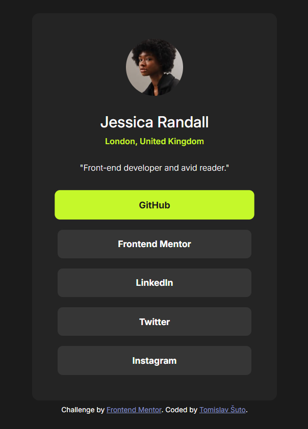

# Frontend Mentor - Social links profile solution

This is a solution to the [Social links profile challenge on Frontend Mentor](https://www.frontendmentor.io/challenges/social-links-profile-UG32l9m6dQ). Frontend Mentor challenges help you improve your coding skills by building realistic projects. 

## Table of contents

- [Overview](#overview)
  - [The challenge](#the-challenge)
  - [Screenshot](#screenshot)
  - [Links](#links)
- [My process](#my-process)
  - [Built with](#built-with)
  - [What I learned](#what-i-learned)
- [Author](#author)

## Overview

### The challenge

- Using `flexbox` and relative units to layout
- Not using a design file, but other ways to measure things like margins and gaps

### Screenshot

### Links

- Solution URL: [solution URL](https://github.com/RetroApe/social-links-profile-main)
- Live Site URL: [live site URL](https://retroape.github.io/social-links-profile-main)

## My process

- Measured everything that I thought necessary to measure
- Thought about the layout and how to apply it to HTML
- Made a skeleton in HTML
- Tried to style using `flexbox`
- Failed
- Did some more digging about `flexbox`
- Repeated first several steps, but I had better idea with `flexbox`
- Succeeded
- Added additional details

### Built with

- HTML
- CSS
- Flexbox

### What I learned

- Better understanding of `flexbox`
- Take measurements from an image

## Author

- Frontend Mentor - [@RetroApe](https://www.frontendmentor.io/profile/RetroApe)
- LinkedIn - [@tomislavsuto81](https://www.linkedin.com/in/tomislavsuto81/)
